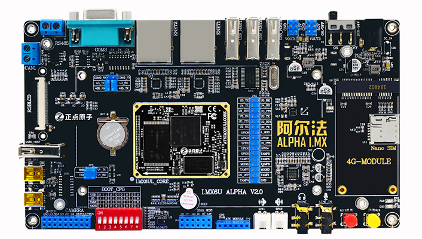

# imx_generator

A CLI tool to ddd boot data to image for ALIENTEK Alpha i.MX board.

Purely write in Rust.



## Usage

```shell
imx_generator 0.1.0
Add boot data to image for ALIENTEK Alpha i.MX board.

USAGE:
    imx_generator.exe [OPTIONS] <input> <output>

FLAGS:
    -h, --help       Prints help information
    -V, --version    Prints version information

OPTIONS:
    -b, --boot <boot>                  Boot device, possible values: ram, sd [default: ram]
    -e, --entry-point <entry-point>    Entry point of application [default: 0x87800000]

ARGS:
    <input>     Path to input file
    <output>    Path to output file
```